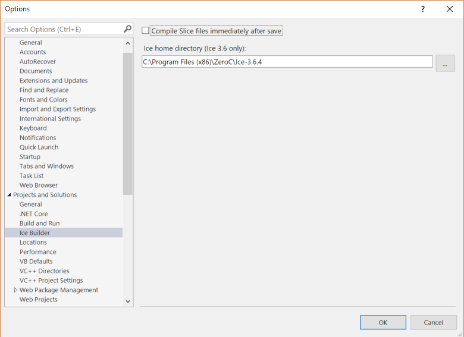
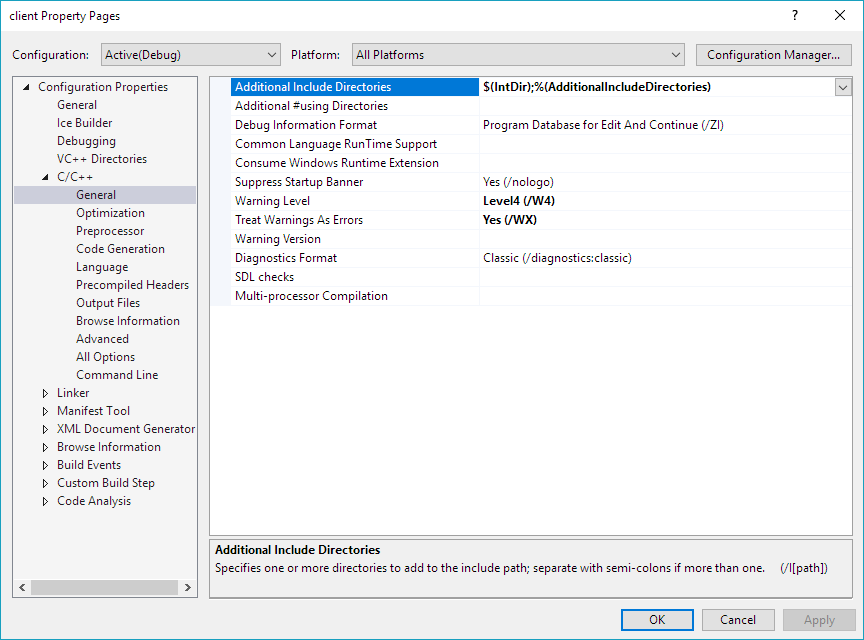
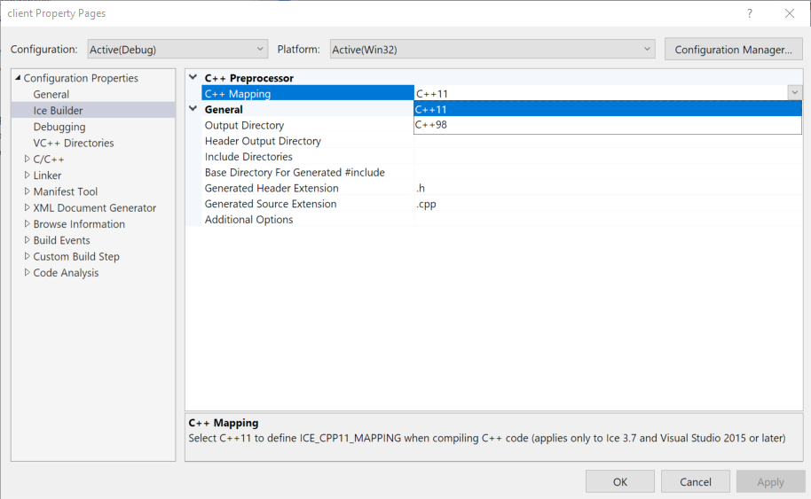
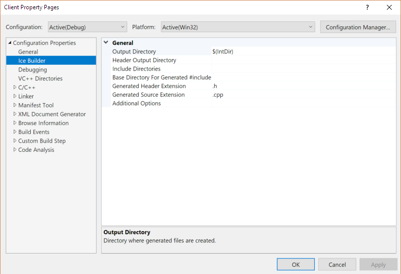
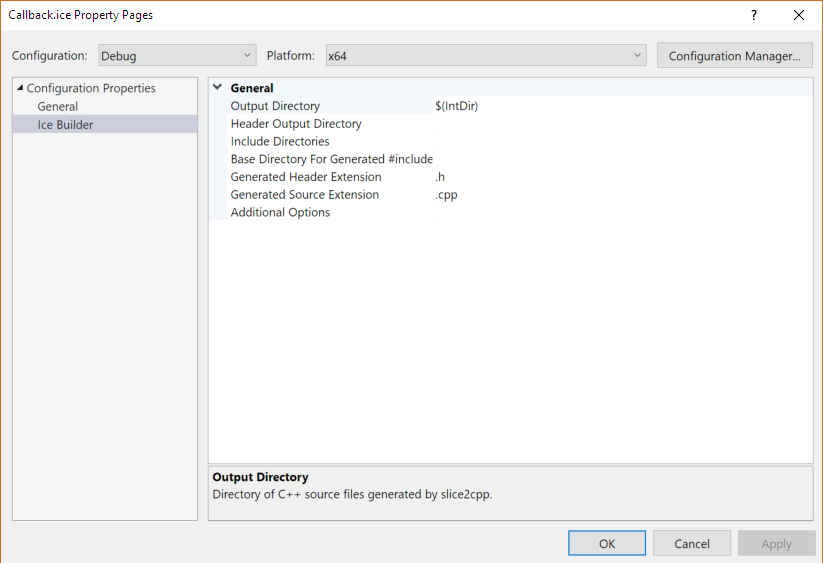
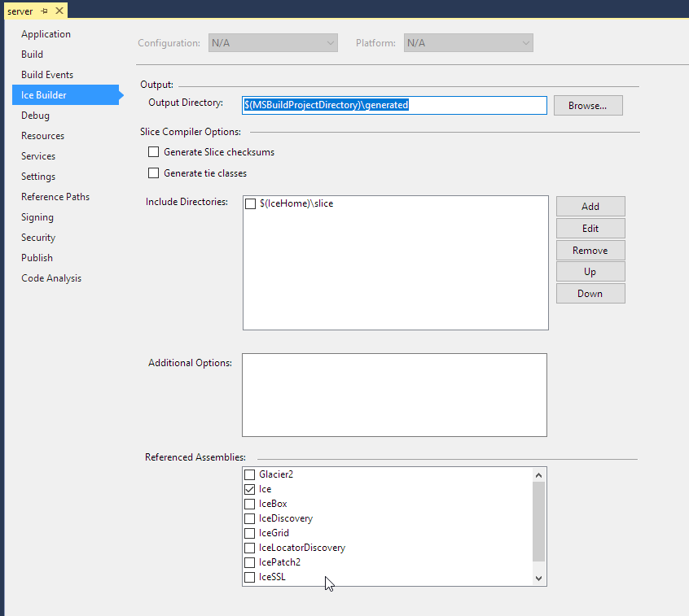

# Ice Builder for Visual Studio

Ice Builder for Visual Studio is a Visual Studio extension that configures [Ice Builder for MSBuild](https://github.com/zeroc-ice/ice-builder-msbuild) for your C++ and C# projects, all within the Visual Studio IDE. It serves as a front-end for Ice Builder for MSBuild: all the build-time processing is performed by Ice Builder for MSBuild.

Ice Builder for Visual Studio is compatible with Visual Studio 2022 and 2026, and works best with the following Ice installations:

- Ice NuGet package for Ice 3.7 or greater

## Contents

- [Installation](#installation)
- [Feedback](#feedback)
- [Overview](#overview)
- [Ice Builder Options](#ice-builder-options)
  - [Compile on Save Configuration](#compile-on-save-configuration)
  - [Ice Home Configuration (Ice 3.6)](#ice-home-configuration-ice-36)
- [C++ Usage](#c-usage)
  - [Adding Slice Files to a C++ Project](#adding-slice-files-to-a-c-project)
  - [Selecting the Slice to C++ Mapping](#selecting-the-slice-to-c-mapping)
  - [Customizing the Slice to C++ Compilation](#customizing-the-slice-to-c-compilation)
- [C# Usage](#c-usage-1)
  - [Adding Slice Files to a C# Project](#adding-slice-files-to-a-c-project-1)
  - [Customizing the Slice to C# Compilation](#customizing-the-slice-to-c-compilation-1)
- [Upgrading your Projects from Ice Builder 4.x](#upgrading-your-projects-from-ice-builder-4x)
- [Migration from the Ice Add-in](#migration-from-the-ice-add-in)
- [Building Ice Builder from Source](#building-ice-builder-from-source)
  - [Build Requirements](#build-requirements)
  - [Build Instructions](#build-instructions)

## Installation

The latest version of Ice Builder is published in the [Visual Studio Marketplace](https://marketplace.visualstudio.com/items?itemName=ZeroCInc.IceBuilder) and can be installed directly using Visual Studio's Tools > Extensions and Updates.

You can also install older versions or preview releases of Ice Builder by downloading the desired `IceBuilder.vsix` from the [GitHub Releases page](https://github.com/zeroc-ice/ice-builder-visualstudio/releases), and then double-clicking on `IceBuilder.vsix`.

## Feedback

We encourage you to [rate and review](https://marketplace.visualstudio.com/items?itemName=ZeroCInc.IceBuilder#review-details) Ice Builder in the Visual Studio Marketplace.

You can also report issues [here on GitHub](https://github.com/zeroc-ice/ice-builder-visualstudio/issues), and ask questions on the [community forums](https://github.com/orgs/zeroc-ice/discussions) or on Ice Builder's [Q & A](https://marketplace.visualstudio.com/items?itemName=ZeroCInc.IceBuilder#qna) page.

## Overview

Ice Builder for MSBuild provides support for compiling Slice source files (`.ice` files) in MSBuild projects, including projects created by Visual Studio. It compiles these Slice files using the Slice to C++ compiler (`slice2cpp`) or the Slice to C# compiler (`slice2cs`) provided by your Ice installation.

You tell Ice Builder for MSBuild which Slice files to compile by adding these files to your project, as described in the sections below. Ice Builder checks whether Slice files need to be compiled or recompiled each time Visual Studio loads a project, and each time you build a project. And if you remove or rename a Slice file with the Visual Studio IDE, Ice Builder for Visual Studio automatically removes the corresponding generated files.

## Ice Builder Options

You can configure the Ice Builder global options on the `Tools` > `Options` > `Project and Solutions` > `Ice Builder` page.

### Compile on Save Configuration

If the `Compile Slice files immediately after save` box is checked, Ice Builder compiles a Slice file when you save it, otherwise it compiles Slice files only during project builds.

## C++ Usage

### Adding Slice Files to a C++ Project

Follow these steps:

1. Add the Ice Builder NuGet package (`zeroc.icebuilder.msbuild`) to your C++ project.

   Adding Ice Builder creates a `Slice Files` filter in your project.

2. Add one or more Slice (`.ice`) files to your project.

3. Add the directory where Ice Builder outputs generated C++ header files (`$(IntDir)` by default) to your project's C/C++ Additional Include Directories:

> :white_check_mark: Make sure to select `All Configurations` and `All Platforms` as shown above.

### Selecting the Slice to C++ Mapping

As of Ice 3.7, `slice2cpp` generates C++ code for two mappings, the [Slice to C++11](https://doc.zeroc.com/pages/viewpage.action?pageId=18255283) mapping and the [Slice to C++98](https://doc.zeroc.com/pages/viewpage.action?pageId=18255332) mapping. You select the C++ mapping used by your C++ code by defining or not defining `ICE_CPP11_MAPPING` during C++ compilation.

Ice Builder selects C++11 as the default mapping when using Visual Studio 2015 or greater, and C++98 as the default mapping with older versions of Visual Studio.

You can overwrite this default selection by setting `C++ Mapping` on the `Ice Builder` property page in the `Configuration Properties` of your project:

> :arrows_counterclockwise: Ice Builder's property page appears after you add `zeroc.icebuilder.msbuild` to your project, but not immediately after you restore this NuGet package in your project. You need to reload your project or solution after a NuGet restore to see this page.

This C++ Mapping selection always applies to all configurations and platforms. See [Selecting the Slice to C++ Mapping](https://github.com/zeroc-ice/ice-builder-msbuild/blob/master/README.md#selecting-the-slice-to-c-mapping) with Ice Builder for MSBuild for further details.

> :information_source: When C++ Mapping is set to C++11, Ice Builder defines `ICE_CPP11_MAPPING` during C++ compilation of your project even though you don't see `ICE_CPP11_MAPPING` among the C/C++ Preprocessor Definitions in the Visual Studio IDE.

### Customizing the Slice to C++ Compilation

Ice Builder allows you to change the options given to `slice2cpp` when compiling a Slice file. You can specify the options that apply to all Slice files in a project with the `Ice Builder` property page in the `Configuration Properties` of your project:

You can also specify options that apply to a single Slice file with the `Ice Builder` property page of that file (this is less common):

> :arrows_counterclockwise: Ice Builder's property pages appear after you add `zeroc.icebuilder.msbuild` to your project, but not immediately after you restore this NuGet package in your project. You need to reload your project or solution after a NuGet restore to see these pages.

These options are always the same for all configurations and platforms, and map to item metadata of the SliceCompile type:

| Property                              | Corresponding SliceCompile Item Metadata |
| ------------------------------------- | ---------------------------------------- |
| Output Directory                      | OutputDir                                |
| Header Output Directory               | HeaderOutputDir                          |
| Include Directories                   | IncludeDirectories                       |
| Base Directory For Generated #include | BaseDirectoryForGeneratedInclude         |
| Generated Header Extension            | HeaderExt                                |
| Generated Source Extension            | SourceExt                                |
| Additional Options                    | AdditionalOptions                        |

See [Customizing the Slice to C++ Compilation](https://github.com/zeroc-ice/ice-builder-msbuild/blob/master/README.md#customizing-the-slice-to-c-compilation) with Ice Builder for MSBuild for further details.

## C# Usage

### Adding Slice Files to a C# Project

Follow these steps:

1. Add the Ice Builder NuGet package (`zeroc.icebuilder.msbuild`) to your C# project.

   Adding Ice Builder creates a `Slice Files` filter in your project.

2. Reload your project if it targets the .NET Framework and you want to customize the Slice to C# compilation described in the next paragraph. If you skip this step, Ice Builder is fully functional except there is no `Ice Builder` tab in your projects's properties.

3. Add one or more Slice (`.ice`) files to your project.

### Customizing the Slice to C# Compilation

Ice Builder allows you to change the options given to `slice2cs` when compiling a Slice file. You can specify the options that apply to all Slice files in a project with the `Ice Builder` tab of your project's properties:

These options are the same for all configurations and platforms, and map to item metadata of the SliceCompile type:

| Property            | Corresponding SliceCompile Item Metadata |
| ------------------- | ---------------------------------------- |
| Output Directory    | OutputDir                                |
| Include Directories | IncludeDirectories                       |
| Additional Options  | AdditionalOptions                        |

See [Customizing the Slice to C# Compilation](https://github.com/zeroc-ice/ice-builder-msbuild/blob/master/README.md#customizing-the-slice-to-c-compilation-1) with Ice Builder for MSBuild for further details.

## Building Ice Builder from Source

### Build Requirements

You need Visual Studio 2026

### Build Instructions

#### Building Visual Studio 2022 extension

Open the `IceBuilder.sln` solution file in Visual Studio 2026 and build the `IceBuilder` project.

After building the Ice Builder extension, there would be a VSIX package in:

- `IceBuilder\bin\Debug\IceBuilder.vsix` or `IceBuilder.Next\bin\Release\IceBuilder.vsix`
