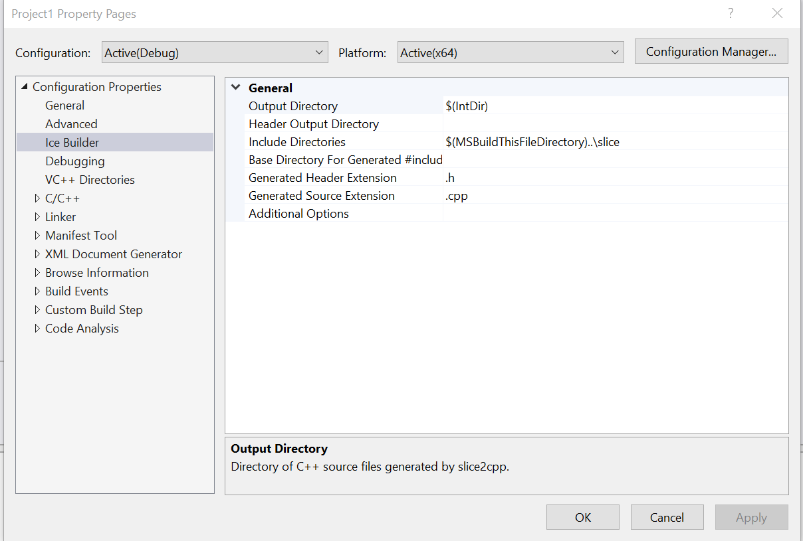
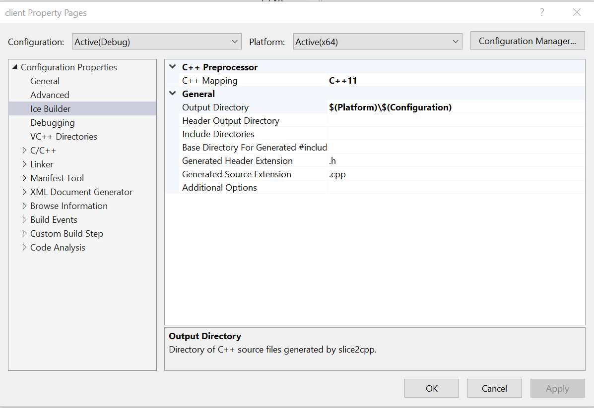
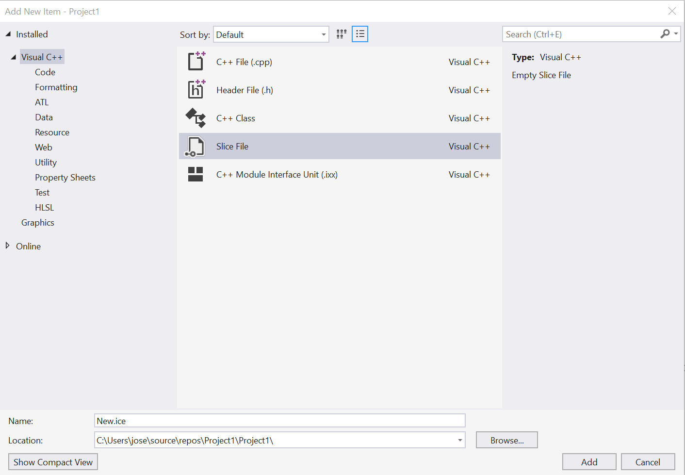
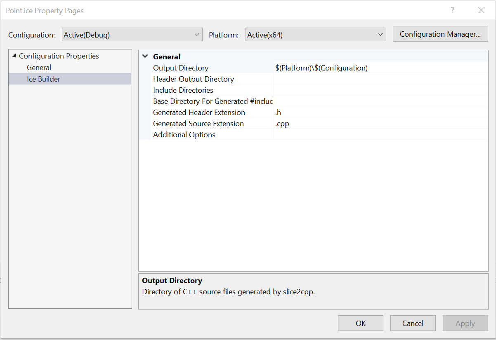
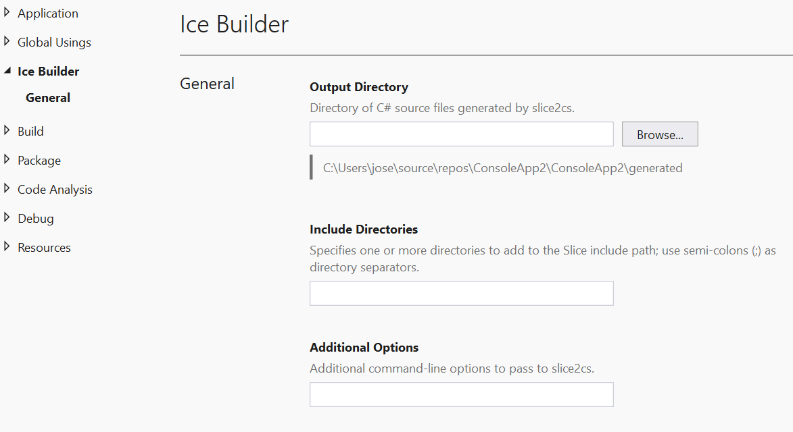
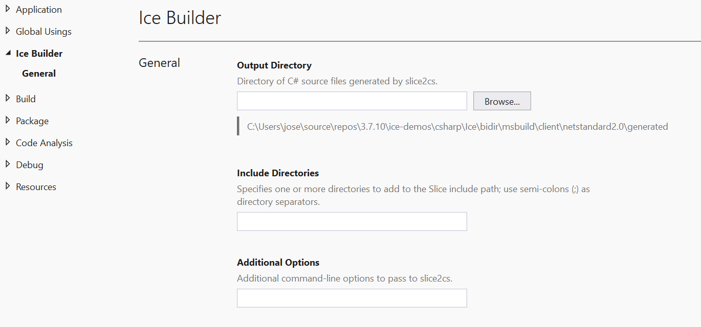
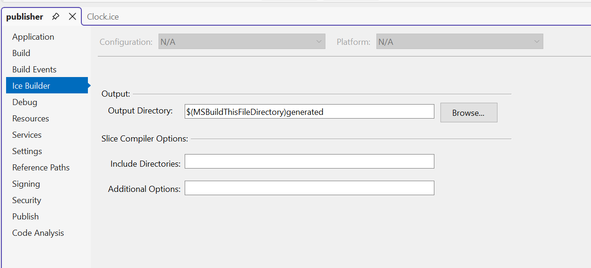

# Ice Builder for Visual Studio

Ice Builder for Visual Studio is a Visual Studio extension that configures Slice MSBuild tasks for your C++ and C#
projects directly within the Visual Studio IDE. It serves as a front-end for the Slice MSBuild tasks; all build-time
processing is performed by these MSBuild tasks.

Ice Builder for Visual Studio is compatible with Visual Studio 2022 and 2026, and works best with the following
Ice installations:

- Ice 3.8 for C++ and C#
- Ice 3.7 for C++ and C#

## Contents

- [Installation](#installation)
- [Feedback](#feedback)
- [Overview](#overview)
  - [C++ Projects](#c-projects)
    - [Ice 3.8 (C++)](#ice-38-c)
    - [Ice 3.7 (C++)](#ice-37-c)
  - [C# Projects](#c-projects-1)
    - [Ice 3.8 (C#)](#ice-38-c-1)
    - [Ice 3.7 (C#)](#ice-37-c-1)
- [Building Ice Builder from Source](#building-ice-builder-from-source)
  - [Build Requirements](#build-requirements)
  - [Build Instructions](#build-instructions)

## Installation

The latest version of Ice Builder for Visual Studio is published in the [Visual Studio Marketplace] and can be
installed directly through Visual Studio’s **Extensions → Manage Extensions** dialog.

## Feedback

We encourage you to [rate and review] Ice Builder for Visual Studio on the Visual Studio Marketplace. Your feedback
helps us improve the extension.

You can also report issues [here on GitHub], and ask questions on the [community forums] or on Ice Builder for Visual
Studio's [Q & A] page.

## Overview

Ice Builder for Visual Studio configures Slice compilation for your C++ and C# projects inside the Visual Studio IDE.
The available options depend on your project’s target language and the version of Ice you are using.

### Ice Builder for Visual Studio Options

#### Visual Studio 2026

You can configure the Ice Builder global options on the Tools > Options > Project and Solutions > More Settings > Ice Builder.

[!ice builder options vs2026](Screenshots/ice-builder-options-vs2026.png)

#### Visual Studio 2022

You can configure the Ice Builder global options on the Tools > Options > Project and Solutions > Ice Builder.

[!ice builder options vs2022](Screenshots/ice-builder-options-vs2022.png)

#### Compile on Save Configuration

If the Compile Slice files immediately after save box is checked, Ice Builder compiles a Slice file when you save it,
otherwise it compiles Slice files only during project builds.

### C++ Projects

#### Ice 3.8 (C++)

For C++ projects using Ice 3.8, Ice Builder for Visual Studio configures the Slice compilation options provided by the
[ZeroC.Ice.Cpp] NuGet package installed in your project. This package includes the Slice Tools MSBuild tasks and the
Slice-to-C++ compiler (`slice2cpp`) required to compile Slice (`.ice`) files into C++ source files.

The Options page is only available for C++ projects using the [ZeroC.Ice.Cpp] NuGet package.

These options map to the item metadata of the `SliceCompile` type:

| Property                              | Corresponding SliceCompile Item Metadata |
| ------------------------------------- | ---------------------------------------- |
| Output Directory                      | OutputDir                                |
| Header Output Directory               | HeaderOutputDir                          |
| Include Directories                   | IncludeDirectories                       |
| Base Directory For Generated #include | BaseDirectoryForGeneratedInclude         |
| Generated Header Extension            | HeaderExt                                |
| Generated Source Extension            | SourceExt                                |
| Additional Options                    | AdditionalOptions                        |

#### Ice 3.7 (C++)

For C++ projects using Ice 3.7, Ice Builder for Visual Studio configures the Slice compilation options provided by the
[ZeroC.Ice.VC143] NuGet package installed in your project. These projects must also install the [ZeroC.IceBuilder.MSBuild]
package, which provides the MSBuild tasks. In this setup, the Slice-to-C++ compiler (`slice2cpp`) is provided by the
[ZeroC.Ice.VC143] package.

The Options page is only available for C++ projects using the [ZeroC.Ice.VC143] NuGet package.

These options map to the item metadata of the `SliceCompile` type:

| Property                              | Corresponding SliceCompile Item Metadata |
| ------------------------------------- | ---------------------------------------- |
| Output Directory                      | OutputDir                                |
| Header Output Directory               | HeaderOutputDir                          |
| Include Directories                   | IncludeDirectories                       |
| Base Directory For Generated #include | BaseDirectoryForGeneratedInclude         |
| Generated Header Extension            | HeaderExt                                |
| Generated Source Extension            | SourceExt                                |
| Additional Options                    | AdditionalOptions                        |

The C++ Mapping option is exclusive to Ice 3.7 and maps to the `IceCppMapping` project property, which allows you to
select between the **C++11** and **C++98** mappings. The corresponding values are `cpp11` and `cpp98`.

| Property    | Corresponding Project Property |
| ----------- | ------------------------------ |
| C++ Mapping | IceCppMapping                  |

### Configuring Slice Compilation for C++ Projects

For both Ice 3.7 and Ice 3.8 C++ projects, the Ice Builder for Visual Studio extension creates a **Slice** file filter
in the Solution Explorer. We recommend adding your Slice (`.ice`) files to this filter for convenience, but you may
place Slice files in any filter within your project.

The extension also provides a **Slice** item template that you can use to add new Slice files to your project.

You can also add existing Slice files using the **Add > Existing Item...** context menu command.

The extension automatically sets the **Item Type** property of added Slice files to `SliceCompile`, which enables Slice
compilation for those files.

The extension adds a `CLCompile` item for each generated C++ source file and a `CLInclude` item for each generated C++
header file. These generated files are placed in the output directories specified in the Slice compilation options.

The generated items are added when you first build the project—or, if the **Compile Slice files immediately after save**
option is enabled, when you save the Slice file.

By default, generated files are placed in `$(IntDir)`, the intermediate directory for the current build configuration and
platform.

To configure the Slice compilation options for a specific Slice file, right-click the file in Solution Explorer and
select **Properties**. The **Slice Compile** property page will appear in the Properties window.

The per-file options override the global project options configured in the Ice Builder options page for a specific Slice
file.

### C# Projects

#### Ice 3.8 (C#)

For C# projects using Ice 3.8, Ice Builder for Visual Studio configures the Slice compilation options provided by the
[ZeroC.Ice.Slice.Tools] NuGet package installed in your project. This package includes the Slice Tools MSBuild tasks
and the Slice-to-C# compiler (`slice2cs`) used to compile Slice (`.ice`) files into C# source files. The generated C#
code depends on the [ZeroC.Ice] package, which provides the Ice runtime for C#.

These options are the same for all configurations and platforms and map to item metadata of the `SliceCompile` type:

| Property            | Corresponding SliceCompile Item Metadata |
| ------------------- | ---------------------------------------- |
| Output Directory    | OutputDir                                |
| Include Directories | IncludeDirectories                       |
| Additional Options  | AdditionalOptions                        |

#### Ice 3.7 (C#)

For C# projects using Ice 3.7, Ice Builder for Visual Studio configures the Slice compilation options provided by the
[ZeroC.IceBuilder.MSBuild] and [ZeroC.Ice.Net] NuGet packages installed in your project. The [ZeroC.IceBuilder.MSBuild]
package provides the Slice Tools MSBuild tasks, while the [ZeroC.Ice.Net] package includes both the Slice-to-C# compiler
(`slice2cs`) used to compile Slice (`.ice`) files into C# source files and the Ice runtime for C#.

**.NET SDK-style project options:**

**.NET Framework project options:**

These options are the same for all configurations and platforms and map to item metadata of the `SliceCompile` type:

| Property            | Corresponding SliceCompile Item Metadata |
| ------------------- | ---------------------------------------- |
| Output Directory    | OutputDir                                |
| Include Directories | IncludeDirectories                       |
| Additional Options  | AdditionalOptions                        |

### Configuring Slice Compilation for C# Projects

Add the required NuGet packages to your C# project

#### For 3.8:

- [ZeroC.Ice.Slice.Tools]
- [ZeroC.Ice]

#### For 3.7:

- [ZeroC.IceBuilder.MSBuild]
- [ZeroC.Ice.Net]

For .NET Framework projects you must reload the project before the Ice Builder options become available and allow
you to change the Slice compilation settings.

## Updating from older versions

The Ice Builder for Visual Studio 7.x release is compatible with Ice Builder for Visual Studio 6.x and 5.x, If your
projects were created with Ice Builder for Visual Studio 6.x or 5.x, they will continue to work without any modifications.

If you are upgrading from Ice Builder for Visual Studio 4.x or earlier, you will need to first use the Ice Builder for Visual Studio
6.x extension to update your projects. See [Upgrading your Projects from Ice Builder 4.x] for more information.

## Building Ice Builder for Visual Studio from Source

### Build Requirements

- Visual Studio 2026

### Build Instructions

1. Open the `IceBuilder.sln` solution file in Visual Studio 2026.
2. Build the `IceBuilder` project.

After the build completes, the generated VSIX package will be located in:

- `IceBuilder\bin\Debug\IceBuilder.vsix`, or
- `IceBuilder\bin\Release\IceBuilder.vsix`

[community forums]: https://github.com/orgs/zeroc-ice/discussions
[here on GitHub]: https://github.com/zeroc-ice/ice-builder-visualstudio/issues
[Ice Builder for MSBuild]: https://github.com/zeroc-ice/ice-builder-msbuild
[Q & A]: https://marketplace.visualstudio.com/items?itemName=ZeroCInc.IceBuilder2022#qna
[rate and review]: https://marketplace.visualstudio.com/items?itemName=ZeroCInc.IceBuilder2022#review-details
[Visual Studio Marketplace]: https://marketplace.visualstudio.com/items?itemName=ZeroCInc.IceBuilder2022
[Upgrading your Projects from Ice Builder 4.x]: https://github.com/zeroc-ice/ice-builder-visualstudio/tree/v6.0.4?tab=readme-ov-file#upgrading-your-projects-from-ice-builder-4x
[ZeroC.Ice.Cpp]: https://www.nuget.org/packages/ZeroC.Ice.Cpp/
[ZeroC.Ice.Net]: https://www.nuget.org/packages/ZeroC.Ice.Net/
[ZeroC.Ice.Slice.Tools]: https://www.nuget.org/packages/ZeroC.Ice.Slice.Tools/
[ZeroC.Ice.V143]: https://www.nuget.org/packages/ZeroC.Ice.V143/
[ZeroC.IceBuilder.MSBuild]: https://www.nuget.org/packages/ZeroC.IceBuilder.MSBuild/
[ZeroC.Ice]: https://www.nuget.org/packages/ZeroC.Ice/
